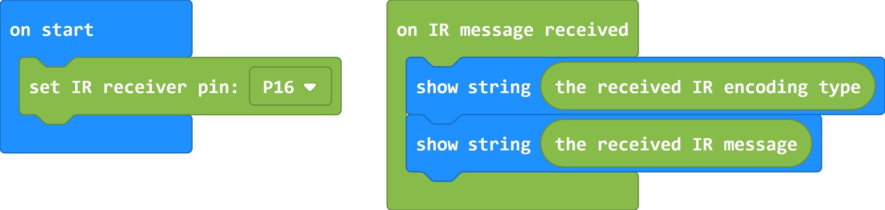
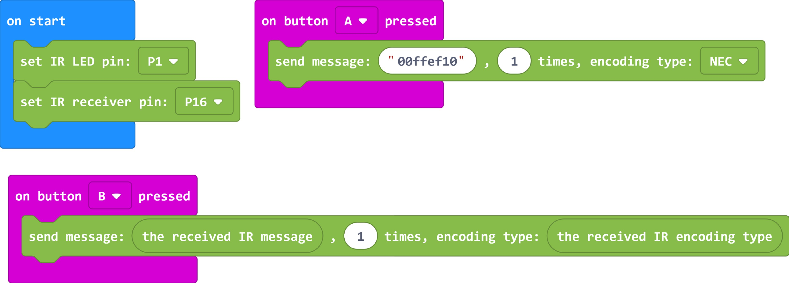

# InfraRed

這是專為micro:bit提供的紅外線積木\
This is the infrared blocks for microbit

## Author
Liou Zheng-Ji\
劉正吉\
[my page, https://sites.google.com/jes.mlc.edu.tw/ljj/](https://sites.google.com/jes.mlc.edu.tw/ljj/)

## Video
[](https://www.youtube.com/watch?v=4JWbFmI6djI)

## Sample1
The code of how to receive IR message


## Sample2
The code of how to send IR message


## License

* MIT

## Supported targets

* for PXT/microbit
(The metadata above is needed for package search.)

```package
IR=github:lioujj/pxt-IR
```